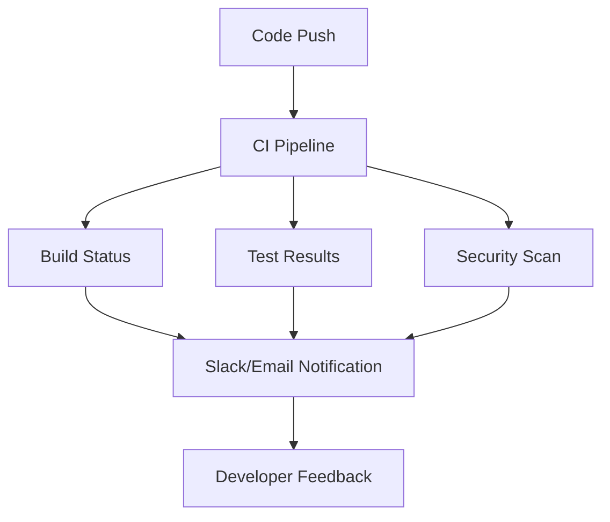

# 🚀 MERN Telemetry Dashboard - CI/CD Configuration

## 📋 Overview

This directory contains comprehensive CI/CD pipelines for the MERN Telemetry Dashboard project, implementing best practices for automated testing, security scanning, and deployment.

## 🔄 Workflows

### 1. 🐳 `docker-ci.yml` - Main CI/CD Pipeline

**Triggers:**
- Push to `main` or `develop` branches
- Pull requests to `main`
- Manual dispatch

**Jobs:**
1. **🔨 Test Builds** - Parallel Docker image builds for React frontend and Express.js backend
2. **🔗 Integration Tests** - Full MERN stack testing with Docker Compose
3. **🛡️ Security Scanning** - Trivy vulnerability scanning for all container images
4. **⚡ Performance Testing** - Artillery load testing against Express.js API endpoints (main branch only)
5. **🚢 Build & Push** - Container registry publishing (main branch only)
6. **🚀 Deploy Staging** - Automated staging deployment
7. **🏷️ Create Release** - Semantic versioning and release notes

### 2. 🛡️ `security.yml` - Security & Quality Analysis

**Triggers:**
- Push to `main` or `develop` branches
- Pull requests to `main`
- Weekly scheduled scans (Mondays at 2 AM UTC)

**Jobs:**
1. **🔍 Code Quality** - SonarCloud analysis and ESLint checks
2. **🛡️ Security Analysis** - CodeQL scanning and npm audit
3. **🧪 Dependency Check** - OWASP dependency vulnerability scanning

### 3. 🛡️ `dependabot.yml` - Dependency Management

**Features:**
- Weekly frontend dependency updates (React, Vite, etc.) - Mondays
- Weekly backend dependency updates (Express.js, Mongoose, etc.) - Mondays
- Weekly Docker base image updates (Node.js Alpine) - Tuesdays
- Weekly GitHub Actions updates (Wednesdays)

## 🔧 Setup Requirements

### GitHub Secrets

Create the following secrets in your GitHub repository:

```bash
# Container Registry
GITHUB_TOKEN          # Automatically provided by GitHub

# Security Scanning (Optional)
SONAR_TOKEN           # SonarCloud integration token
NVD_API_KEY           # National Vulnerability Database API key

# Cloud Deployment (Optional)
AWS_ACCESS_KEY_ID     # AWS deployment credentials
AWS_SECRET_ACCESS_KEY
AZURE_CREDENTIALS     # Azure deployment credentials
GCP_SA_KEY           # Google Cloud service account key
```

### Environment Configuration

1. **Staging Environment**
   ```bash
   # Configure in GitHub Settings > Environments
   Environment Name: staging
   Required Reviewers: [optional]
   Environment Secrets: [deployment-specific]
   ```

2. **Production Environment** (for future use)
   ```bash
   # Configure in GitHub Settings > Environments
   Environment Name: production
   Required Reviewers: [recommended]
   Protection Rules: Restrict to main branch
   ```

## 📊 Pipeline Features

### 🔄 Continuous Integration

- **Multi-Architecture Builds**: AMD64 and ARM64 support for MERN stack containers
- **Parallel Testing**: React frontend and Express.js backend builds run simultaneously
- **Health Checks**: Comprehensive service health validation for all MERN components
- **Error Handling**: Graceful failure handling with detailed log collection

### 🛡️ Security First

- **Vulnerability Scanning**: Container and dependency scanning
- **Code Analysis**: Static analysis with CodeQL and SonarCloud
- **Secret Detection**: Automatic secret scanning
- **SARIF Integration**: Security results in GitHub Security tab

### 📈 Performance Monitoring

- **Load Testing**: Artillery-based Express.js API performance testing
- **Resource Monitoring**: Docker container resource usage for MERN stack
- **Benchmark Tracking**: Performance regression detection across API endpoints
- **Alerting**: Performance threshold alerts for Express.js response times

### 🚀 Deployment Automation

- **GitOps Workflow**: Infrastructure as code principles
- **Blue-Green Deployment**: Zero-downtime deployments
- **Rollback Capability**: Automatic rollback on failure
- **Multi-Environment**: Development, staging, production

## 🔍 Monitoring & Observability

### Pipeline Monitoring



### Quality Gates

1. **Build Gate**: All Docker images must build successfully
2. **Test Gate**: Integration tests must pass
3. **Security Gate**: No critical vulnerabilities allowed
4. **Performance Gate**: API response times under 500ms
5. **Quality Gate**: SonarCloud quality gate must pass

## 📚 Usage Examples

### Manual Workflow Trigger

```bash
# Trigger workflow manually via GitHub CLI
gh workflow run "Docker CI/CD Pipeline" \
  --ref main \
  --field environment=staging
```

### Local Testing

```bash
# Test the same pipeline locally
cd MERN-Telemetry

# Build and test
docker-compose up -d --build
sleep 30

# Run health checks
curl -f http://localhost:5001/api/cpu
curl -f http://localhost:3000

# Cleanup
docker-compose down -v
```

### Performance Testing

```bash
# Install Artillery
npm install -g artillery@latest

# Run load test
artillery run .github/workflows/load-test.yml
```

## 🚨 Troubleshooting

### Common Issues

1. **Build Failures**
   ```bash
   # Check build logs
   docker-compose logs backend_api
   
   # Rebuild with no cache
   docker-compose build --no-cache
   ```

2. **Health Check Failures**
   ```bash
   # Check service status
   docker-compose ps
   
   # Test API manually
   # Test Express.js API manually
curl -v http://localhost:5001/health
curl -v http://localhost:5001/api/cpu
   ```

3. **Security Scan Failures**
   ```bash
   # Run local security scan
   docker run --rm -v $(pwd):/workspace \
     aquasec/trivy fs /workspace
   ```

### Pipeline Debugging

- **Logs**: Check GitHub Actions logs for detailed error information
- **Artifacts**: Download test results and security reports
- **Local Reproduction**: Use same commands locally to reproduce issues
- **Environment Variables**: Verify all required secrets are configured

## 📈 Metrics & KPIs

### Pipeline Metrics

- **Build Success Rate**: Target 95%+
- **Average Build Time**: Target < 10 minutes
- **Test Coverage**: Target 80%+
- **Security Vulnerabilities**: Target 0 critical

### Performance Metrics

- **API Response Time**: Target < 500ms
- **Frontend Load Time**: Target < 3 seconds
- **Container Startup Time**: Target < 30 seconds
- **Resource Usage**: Target < 1GB RAM per service

## 🔄 Continuous Improvement

### Regular Reviews

- **Weekly**: Review failed builds and security alerts
- **Monthly**: Analyze performance trends and optimization opportunities
- **Quarterly**: Update dependencies and security policies
- **Annually**: Review and update CI/CD architecture

### Automation Enhancements

- **Smart Testing**: Only run affected tests based on changed files
- **Caching Optimization**: Improve build times with better caching
- **Parallel Execution**: Increase parallelization where possible
- **Cost Optimization**: Monitor and optimize CI/CD resource usage

---

*This CI/CD configuration ensures reliable, secure, and efficient deployment of the MERN Telemetry Dashboard while maintaining high code quality and security standards.*
