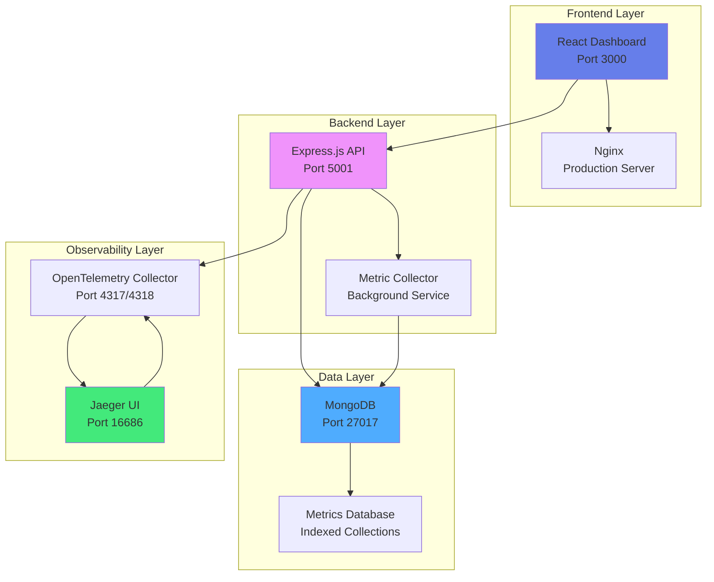

# 🚀 MERN Telemetry Dashboard

A comprehensive, real-time system monitoring dashboard built with the **MERN stack** (MongoDB, Express.js, React, Node.js), featuring distributed tracing, Docker orchestration, and beautiful data visualizations.

## 🏆 **Tech Stack Overview**
- **Frontend**: React 18 + Vite + CSS3 Glassmorphism
- **Backend**: Express.js 4.19 + Node.js 18 + Alpine Linux  
- **Database**: MongoDB 8.0 + Mongoose ODM
- **DevOps**: Docker Compose + Nginx + OpenTelemetry + Jaeger


## 📋 Table of Contents

- [🏗️ Architecture Overview](#%EF%B8%8F-architecture-overview)
- [✨ Features](#-features)
- [🛠️ Technology Stack](#%EF%B8%8F-technology-stack)
- [🚀 Quick Start](#-quick-start)
- [📊 API Endpoints](#-api-endpoints)
- [🐳 Docker Services](#-docker-services)
- [📈 Monitoring & Observability](#-monitoring--observability)
- [🔧 Configuration](#-configuration)
- [🧪 Testing](#-testing)
- [📚 Development](#-development)
- [🤝 Contributing](#-contributing)
- [📄 License](#-license)

## 🏗️ Architecture Overview



### 🔄 Data Flow Architecture

1. **System Metrics Collection**: Background collector service monitors CPU, Memory, Disk, and Network
2. **Data Storage**: Metrics stored in MongoDB with timestamp indexing for efficient queries
3. **Express.js API Layer**: RESTful endpoints serve latest metrics with CORS middleware support
4. **Real-time Frontend**: React dashboard auto-refreshes every 30 seconds
5. **Observability**: OpenTelemetry traces requests through Jaeger for monitoring

## ✨ Features

### 📊 **Real-time System Monitoring**
- **CPU Performance**: Multi-core usage tracking with user/system load breakdown
- **Memory Analytics**: RAM usage with detailed used/free/total metrics
- **Disk I/O Monitoring**: Read/write operations across multiple drives
- **Network Activity**: Interface monitoring with RX/TX data transfer

### 🎨 **Beautiful User Interface**
- **Purple Gradient Theme**: Modern glassmorphism design with neumorphic elements
- **Responsive Grid Layout**: Adapts to different screen sizes
- **Interactive Metric Cards**: Hover effects and trend indicators
- **Real-time Updates**: Auto-refresh with manual refresh options

### 🔧 **Enterprise Features**
- **Docker Orchestration**: Complete containerized deployment
- **Distributed Tracing**: OpenTelemetry + Jaeger integration
- **Error Boundaries**: Graceful error handling and recovery
- **API Health Monitoring**: Individual endpoint status tracking

## 🛠️ Technology Stack

### 🏗️ **MERN Stack Core**
| Component | Technology | Version | Purpose |
|-----------|------------|---------|---------|
| **M**ongoDB | MongoDB | 8.0 | Document database with time-series collections |
| **E**xpress.js | Express.js | 4.19 | RESTful API server with middleware support |
| **R**eact | React | 18 | Modern frontend with hooks and functional components |
| **N**ode.js | Node.js | 18 | JavaScript runtime with Alpine Linux containers |

### **Frontend (React)**
- **React 18** - Modern hooks-based architecture with functional components
- **Vite** - Next-generation build tool with Hot Module Replacement (HMR)
- **Fetch API** - Promise-based HTTP client for Express.js API communication
- **CSS3** - Custom glassmorphism styling with CSS variables and gradients

### **Backend (Express.js)**
- **Node.js 18** - JavaScript runtime with Alpine Linux containers
- **Express.js 4.19** - Fast, unopinionated web framework for RESTful APIs
- **Mongoose 8.18** - Elegant MongoDB object modeling for Node.js
- **systeminformation 5.27** - Cross-platform system metrics collection library

### **Database (MongoDB)**
- **MongoDB 8.0** - Document database with aggregation pipelines and ACID transactions
- **Indexed Collections** - Optimized timestamp-based queries for time-series data
- **Data Retention** - Configurable metric history storage with TTL indexes

### **DevOps & Observability**
- **Docker Compose** - Multi-service orchestration and container management
- **Nginx** - High-performance web server with gzip compression and caching
- **Jaeger** - Distributed tracing and performance monitoring platform
- **OpenTelemetry** - Observability framework for metrics, logs, and traces

### 🔧 **Additional Tools & Libraries**
| Category | Technology | Purpose |
|----------|------------|---------|
| **Containerization** | Docker & Docker Compose | Service orchestration and deployment |
| **Process Management** | Node.js systeminformation | Cross-platform system metrics collection |
| **Database ODM** | Mongoose | MongoDB object modeling and validation |
| **HTTP Client** | Fetch API | Frontend to Express.js API communication |
| **Build Tools** | Vite | Fast development builds and HMR |
| **Web Server** | Nginx | Static file serving and reverse proxy |
| **Tracing** | Jaeger + OpenTelemetry | Distributed request tracing |

## 🚀 Quick Start

### Prerequisites
- Docker Desktop 4.0+
- Docker Compose 2.0+
- Git

### 1. Clone Repository
```bash
git clone https://github.com/Esoteriikos/Learning.git
cd Learning/MERN-Telemetry
```

### 2. Start All Services
```bash
docker-compose up -d
```

### 3. Access Applications
- **📊 Dashboard**: http://localhost:3000
- **🔌 API**: http://localhost:5001/api (Express.js endpoints)
- **🔍 Jaeger UI**: http://localhost:16686 (Distributed tracing)
- **💾 MongoDB**: localhost:27017 (Database connection)

### 4. Verify Deployment
```bash
# Check all services are running
docker-compose ps

# View logs
docker-compose logs -f frontend
docker-compose logs -f backend_api
```

## 📊 API Endpoints

### Health & Status
```http
GET /health               # Express.js server health check
GET /api/health           # API health check
GET /api/status           # System status overview
```

### Metrics Endpoints (Express.js Routes)
```http
GET /api/cpu              # CPU performance metrics
GET /api/memory           # Memory usage statistics  
GET /api/disk             # Disk I/O operations
GET /api/network          # Network interface activity
```

### Response Format
```json
{
  "_id": "ObjectId",
  "timestamp": "2025-09-08T19:00:00.000Z",
  "currentLoad": 25.4,
  "userLoad": 15.2,
  "systemLoad": 10.2,
  "cores": 8,
  "__v": 0
}
```

## 🐳 Docker Services

### Service Architecture (MERN Stack + Observability)
```yaml
services:
  frontend:        # React 18 + Vite + Nginx (Port 3000)
  backend_api:     # Express.js 4.19 + Node.js 18 (Port 5001)
  backend_collector: # Node.js Metrics Collection Service
  mongo:           # MongoDB 8.0 Database (Port 27017)
  jaeger:          # Jaeger Tracing UI (Port 16686)
  otel-collector:  # OpenTelemetry Collector (Port 4317/4318)
```

### MERN Stack Service Details
| Service | Technology Stack | Port | Purpose |
|---------|------------------|------|---------|
| **frontend** | React 18 + Vite + Nginx | 3000 | User interface and dashboard |
| **backend_api** | Express.js 4.19 + Node.js 18 | 5001 | RESTful API server |
| **backend_collector** | Node.js 18 + systeminformation | - | Background metrics collection |
| **mongo** | MongoDB 8.0 | 27017 | Document database storage |

### Build Commands
```bash
# Build specific service
docker-compose build frontend          # React frontend
docker-compose build backend_api       # Express.js API

# Rebuild all services
docker-compose build --no-cache

# Scale services (Express.js can handle multiple instances)
docker-compose up -d --scale backend_collector=2
```

## 📈 Monitoring & Observability

### Jaeger Tracing
- **Service Map**: Visualize service dependencies
- **Trace Analysis**: Request flow through microservices
- **Performance Metrics**: Latency and error rate monitoring

### Application Metrics
- **Collection Frequency**: Every 5 seconds
- **Data Retention**: Configurable via environment variables
- **Index Strategy**: Timestamp-based for efficient queries

### Health Monitoring
```bash
# Check Express.js server health
curl http://localhost:5001/health

# Test Express.js API endpoints
curl http://localhost:5001/api/cpu | jq .

# View container resources
docker stats
```

## 🔧 Configuration

### Environment Variables
Create `.env` file in project root:
```env
# Database Configuration
MONGO_URI=mongodb://mongo:27017/telemetry
DB_NAME=telemetry

# Express.js API Configuration
API_PORT=5001
NODE_ENV=production
CORS_ORIGIN=http://localhost:3000

# Collection Settings
COLLECTION_INTERVAL=5000
DATA_RETENTION_DAYS=7

# OpenTelemetry
OTEL_EXPORTER_OTLP_ENDPOINT=http://otel-collector:4317
JAEGER_ENDPOINT=http://jaeger:16686
```

### Database Indexes
```javascript
// Automatic index creation for performance
db.cpumetrics.createIndex({ timestamp: -1 })
db.memorymetrics.createIndex({ timestamp: -1 })
db.diskmetrics.createIndex({ timestamp: -1 })
db.networkmetrics.createIndex({ timestamp: -1 })
```

## 🧪 Testing

### Manual Testing
```bash
# Test Express.js API endpoints
npm run test:api

# Test MongoDB database connectivity
npm run test:db

# Test React frontend components
npm run test:frontend
```

### Docker Health Checks
```bash
# Verify all containers are healthy
docker-compose ps

# Check Express.js API container logs
docker-compose logs --tail=50 backend_api
```

### Load Testing
```bash
# Install artillery for Express.js API load testing
npm install -g artillery

# Run load test against Express.js endpoints
artillery run load-test.yml
```

## 📚 Development

### Local Development Setup
```bash
# Install dependencies
cd backend && npm install     # Express.js server dependencies
cd ../frontend && npm install # React frontend dependencies

# Start development servers
cd backend && npm run dev     # Express.js with nodemon
cd frontend && npm run dev    # React with Vite HMR
```

### Project Structure
```
MERN-Telemetry/
├── backend/
│   ├── src/
│   │   ├── models/          # Mongoose schemas for MongoDB
│   │   ├── routes/          # Express.js API routes
│   │   ├── middleware/      # Express.js middleware
│   │   └── services/        # Business logic services
│   ├── collector.js         # Node.js metrics collection service
│   ├── server.js           # Express.js API server entry point
│   └── Dockerfile          # Express.js container config
├── frontend/
│   ├── src/
│   │   ├── components/      # React functional components
│   │   ├── hooks/          # Custom React hooks
│   │   └── styles/         # CSS modules and stylesheets
│   ├── public/             # Static assets
│   └── Dockerfile          # React + Nginx container
├── docker-compose.yml       # MERN stack orchestration
└── otel-collector-config.yml # OpenTelemetry configuration
```

### Adding New Metrics
1. **Create Mongoose Schema** in `backend/src/models/` for MongoDB document structure
2. **Add Collection Logic** in Node.js collector service (`collector.js`)
3. **Create Express.js Route** in `backend/src/routes/` for API endpoint
4. **Update React Hook** in `frontend/src/hooks/` for data fetching
5. **Add UI Component** in `frontend/src/components/` for metric visualization
